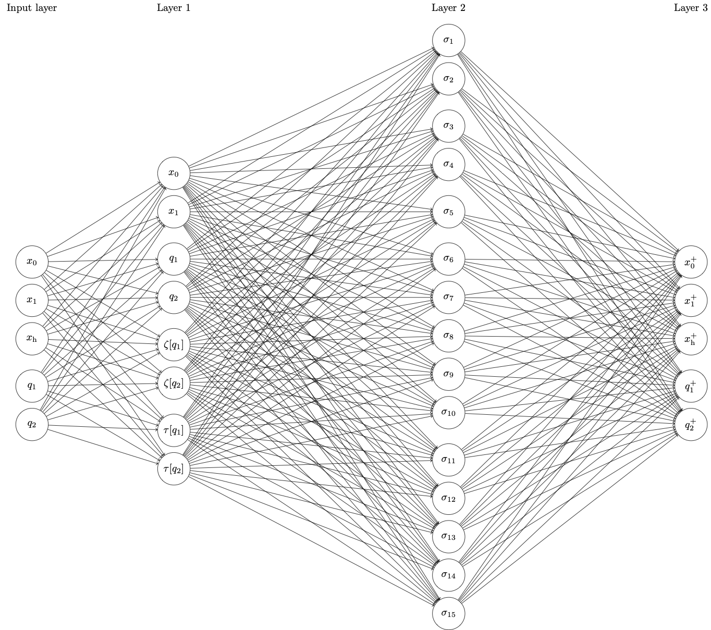

# On the Turing Completeness of Recurrent Neural Networks
A formal proof of how to build a Recurrent Neural Network that simulates an arbitrary Turing Machine, with some code implementing a specific case.

